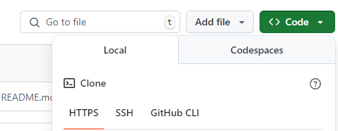

# Github
ローカルからリモートにプッシュする方法

## 1 ローカルからリモートにプッシュする方法
ローカルからリモートにプッシュする方法を下記で説明します。

### 🔹1.1 新規リポジトリの作成
新しい Git リポジトリを作成するには、以下のコマンドを実行します。
- フォルダ作成
```sh
mkdir MyProject
```
- フォルダ移動
```sh
cd MyProject
```

### 🔹1.2 Git が新しいリポジトリを初期化
Git の設定コマンドで、Git が新しいリポジトリを初期化する際にデフォルトで作成するブランチ名を変更するためのものです。<br>
以下のコマンドを実行すると、これから新しいリポジトリを作成した際に、自動的に main ブランチが作成されるようになります。
```sh
git config --global init.defaultBranch main
```

### 🔹1.3 Git リポジトリを初期化
新しい Git リポジトリを作成するコマンドです。<br>
これを実行することで、ディレクトリを Git の管理下に置き、その後 Git のコマンドを使ってファイルを追跡・管理できるようになります。<br>
```sh
git init
```

### 🔹1.4 Git のステージングエリアに変更を追加
Git のステージングエリアに変更を追加するためのコマンドです。<br>
このコマンドを実行すると、現在のディレクトリとそのサブディレクトリ内のすべての変更（新規ファイル、削除されたファイル、変更されたファイル）がステージングエリアに追加されます。<br>
ステージングエリアは、次のコミットに含める変更を一時的に格納する場所です<br>
```sh
git add .
```

### 🔹1.5 Git のローカルリポジトリにコミット
ステージングエリアに追加された変更をローカルリポジトリにコミットするためのコマンドです。<br>
- git commit: Git のコミット操作を実行します。コミットは、変更をローカルリポジトリに記録する行為です。コミットを行うことで、リポジトリの履歴にその時点での変更が保存され、後から変更を追跡できるようになります。<br>
- -m: コミットメッセージを指定するオプションです。-m の後に続けて、コミットの内容を簡潔に説明するメッセージを記述します。<br>
- "first commit": これはコミットメッセージです。ここでは「最初のコミット」という意味で、リポジトリの初回のコミットを表すメッセージです。<br>
```sh
git commit -m "first commit"
```

### 🔹1.6 Git リポジトリのリモートを追加する
Git リポジトリのリモート（GitHub など）を追加するためのコマンドです。このコマンドにより、ローカルリポジトリとリモートリポジトリを接続することができます。<br>
- git remote add: リモートリポジトリをローカルリポジトリに追加するコマンドです。<br>
- origin: これはリモートリポジトリの名前です。通常、最初に追加するリモートリポジトリには origin という名前が使われます。origin はリモートリポジトリのエイリアスとして、以後リモート操作で使用されます。<br>
- https://github.com/User.Name/リポジトリ名: これはリモートリポジトリの URL です。この場合、GitHub 上にあるユーザーのリポジトリです。<br>
```sh
git remote add origin https://github.com/〇〇/〇〇.git
```
URLは、**code内にあるHTTPS**<br>


### 🔹1.7 ローカルリポジトリの変更をリモートリポジトリへプッシュ
ローカルリポジトリの変更をリモートリポジトリ（この場合、GitHub 上のリポジトリ）にプッシュするためのコマンドです。このコマンドは、特に最初にリモートリポジトリに変更をプッシュする際に使用されます。<br>
- git push: リモートリポジトリに変更をアップロードするコマンドです。これにより、ローカルリポジトリで行った変更がリモートリポジトリに反映されます。<br>
- -u: -u（または --set-upstream）オプションは、ローカルブランチとリモートブランチを紐づけるために使用します。このオプションを使うと、今後 git push や git pull を使う際に、リモートのブランチを指定しなくても自動的に関連付けられたリモートブランチに対して操作を行うことができます。<br>
- origin: これはリモートリポジトリの名前です。最初にリモートリポジトリを設定する際に origin という名前がよく使われます。リモートリポジトリのエイリアスとして、この名前が使われます。<br>
- main: これはプッシュするローカルブランチの名前です。デフォルトでは、GitHub などのリポジトリで新しく作成したリポジトリの初期ブランチは main です（以前は master が使われていましたが、現在は main が推奨されています）。<br>
```sh
git push -u origin main
```

### 🔹1.8 【上記エラー時】強制的にリモートリポジトリにプッシュ
ローカルリポジトリの main ブランチの変更を強制的にリモートリポジトリの main ブランチにプッシュするためのコマンドです。特にリモートリポジトリの履歴を上書きする場合に使用します。<br>
- git push: ローカルリポジトリからリモートリポジトリに変更をプッシュする基本的なコマンドです。<br>
- --force: このオプションは、ローカルの変更をリモートにプッシュする際に、リモートリポジトリの履歴を強制的に上書きするために使用します。通常、リモートに存在する変更履歴と競合している場合、Git はプッシュを拒否します。しかし、--force オプションを使うことで、リモートの履歴をローカルの履歴で強制的に上書きできます。<br>
- origin: これはリモートリポジトリの名前です。通常、最初に設定するリモートリポジトリの名前は origin です。<br>
- main: これはローカルおよびリモートで使用しているブランチ名です。通常、GitHub や GitLab では main ブランチがデフォルトのブランチ名として使用されます。<br>
```sh
git push --force origin main
```
こちら実行後、再度プッシュコマンド(1つ前のコマンド)を実行してください。

## 2 Windows での Git 環境構築手順

### 2.1 Git の公式サイトからインストール
以下の URL にアクセスし、Windows 用の Git をダウンロードします。<br>
[Git for Windows](https://gitforwindows.org/)<br>

ダウンロードした .exe ファイルを実行し、インストールを開始します。<br>

インストール時のオプションはデフォルトのままで問題ありませんが、以下のポイントを確認してください。<br>
- PATH の設定:Git from the command line and also from 3rd-party software を選択（推奨）<br>
- HTTPS での通信:Use the OpenSSL library を選択（推奨）<br>
- デフォルトエディタ:Use Vim などを選択（好みに応じて変更可）<br>
- Git の初期ブランチ名:Let Git decide または main を選択<br>

インストール完了後、ターミナル（PowerShell または Git Bash）を開き、以下のコマンドでインストールを確認します。<br>

**gitバージョン確認（インストール確認）**
```sh
git --version
```
**出力例**
```sh
git version 2.40.1.windows.1
```

### 2.2 Git の基本設定
- ユーザー名とメールアドレスの設定<br>
Git を使用する前に、ユーザー情報を設定する必要があります。<br>
以下のコマンドを実行し、Git にユーザー情報を登録します。<br>

**Githubに登録したユーザー名**
```sh
git config --global user.name "Your Name"
```
**Githubに登録したメールアドレス**
```sh
git config --global user.email "your.email@example.com"
```

- 設定の確認<br>
設定した情報を確認するには、以下のコマンドを実行します。<br>

**情報確認**
```sh
git config --global --list
```
